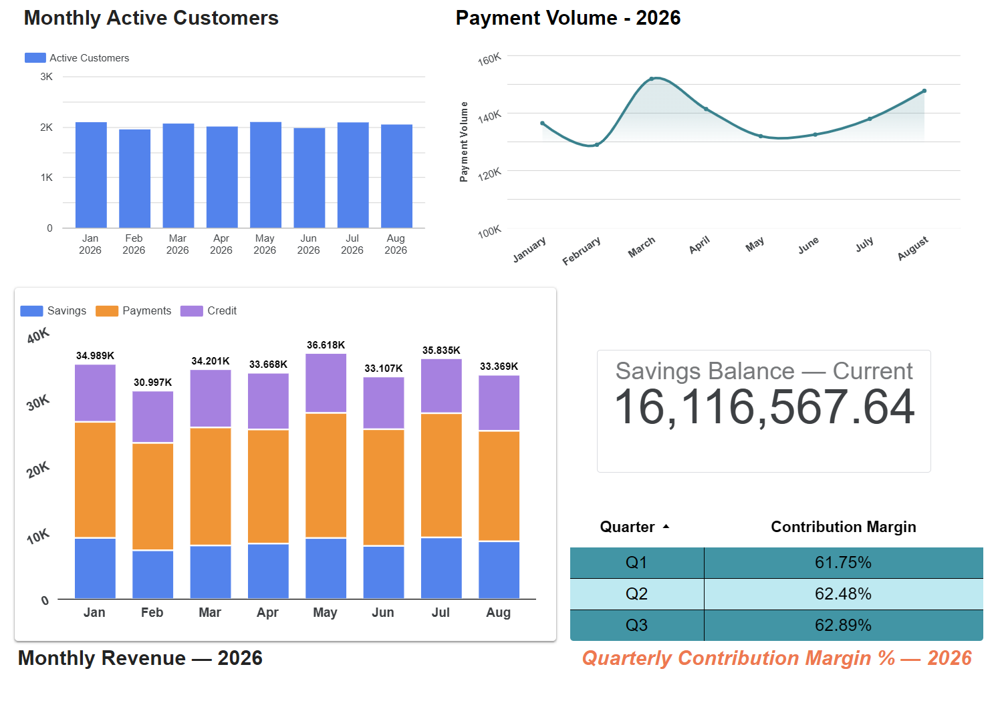
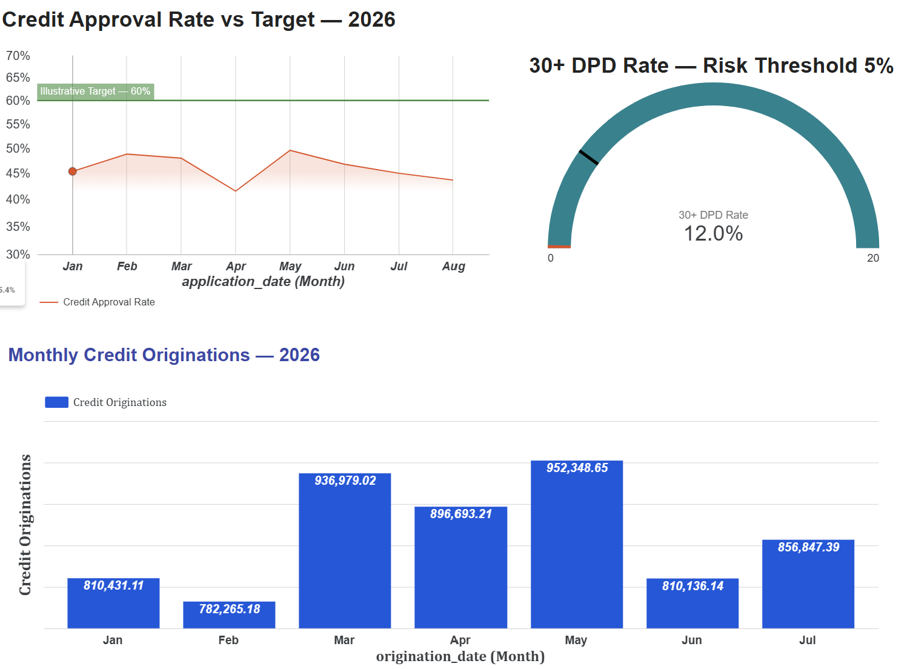
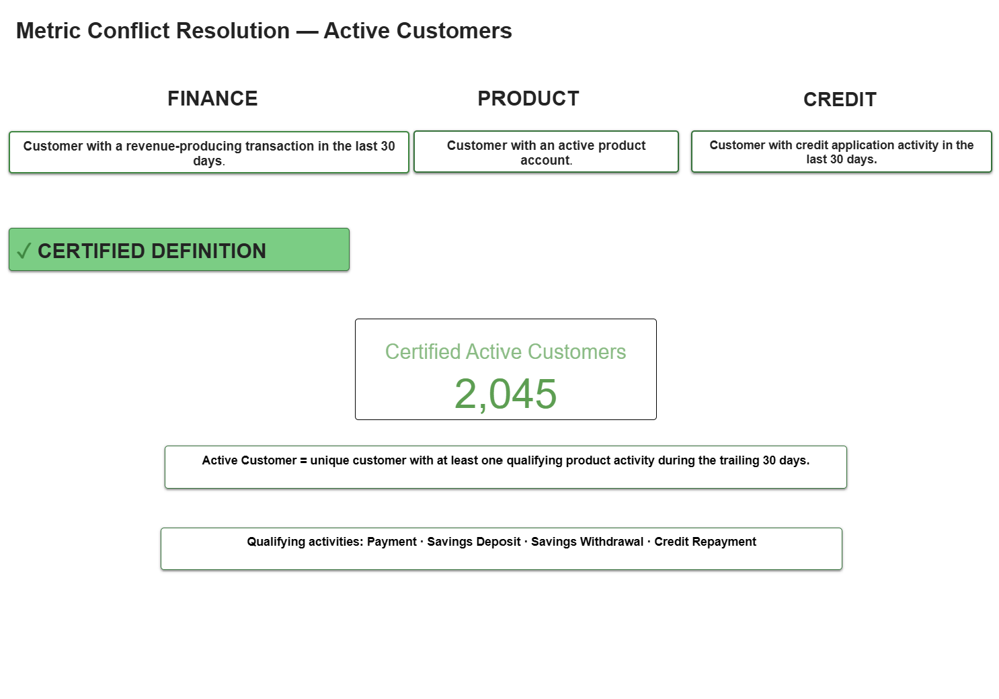

# MAL Enterprise BI Foundation

A working enterprise BI foundation prototype for MAL, built with synthetic/anonymised data and designed around a governed KPI layer.

## Live Dashboard

**Looker Studio:** [`PUBLIC LOOKER STUDIO URL`](https://datastudio.google.com/reporting/0b2a3794-07f1-4e81-b442-83e780ad9a3d)

The report is designed to be publicly viewable without a login.

## What This Prototype Demonstrates

### 1. Executive Dashboard — Part 1

Enterprise-level visibility across Product, Finance and Credit:

- Certified Active Customers
- Monthly Active Customers
- Payment Volume
- Savings Balance
- Monthly Revenue
- Contribution Margin %

### 2. Executive Dashboard — Part 2

Credit growth and risk indicators:

- Credit Approval Rate
- Credit Originations
- 30+ DPD Rate

### 3. Credit & Lending

A deeper domain view covering:

- Credit approval funnel
- Portfolio outstanding balance
- Portfolio by risk band
- PAR30
- 30+ DPD rate by origination cohort

### 4. Metric Conflict Resolution

The Metric Conflict Resolution view demonstrates why different teams can report different values for the same business concept.

**Active Customers** is shown using three legacy definitions:

- **Finance:** customers with a revenue-producing transaction in the last 30 days.
- **Product:** customers with an active product account.
- **Credit:** customers with credit application activity in the last 30 days.

These definitions are displayed **for comparison and reconciliation**, not as competing official KPIs.

The **certified enterprise definition** is clearly marked and should be used for executive and cross-domain reporting:

> **Active Customer = a unique customer with at least one qualifying product activity during the trailing 30 days.**

Qualifying activities are:

- Payment
- Savings Deposit
- Savings Withdrawal
- Credit Repayment

If the legacy definitions produce different values, the difference is interpreted as a **definition mismatch**, rather than automatically as a data-quality error.

The certified definition becomes the single source of truth, while the legacy measures remain available to help teams reconcile historical reporting and understand why their previous numbers differed.

The governance response is:

**Make the differences visible → agree on the business definition → certify it → use it consistently → retain legacy definitions for reconciliation → review periodically to prevent definition drift.**

### 5. KPI Dictionary & Self-Service

The report includes a governed KPI dictionary with 20 metrics covering:

- Metric name
- Domain
- Owner
- Business definition
- Formula
- Data source
- Refresh cadence
- Certified vs exploratory status

The self-service section documents available datasets, access-request requirements and BI SLAs.

---

## Data Model

The prototype uses six synthetic operational datasets plus a KPI dictionary:

| Dataset | Purpose |
|---|---|
| `customers` | Customer profiles, segments and acquisition |
| `product_accounts` | Product ownership, status and balances |
| `customer_activity` | Payments, savings activity and credit repayments |
| `finance_transactions` | Revenue and direct cost transactions |
| `credit_applications` | Credit application and underwriting funnel |
| `credit_portfolio` | Loan balances, origination, DPD and risk bands |
| `kpi_dictionary` | Enterprise metric definitions and governance status |

Key relationships:

customers
   ├── product_accounts
   ├── customer_activity
   ├── finance_transactions
   ├── credit_applications
   └── credit_portfolio

## Dashboard Screenshots / Offline Reference

The screenshots below are included as a fallback reference for the deployed Looker Studio dashboard.

The live dashboard is the primary deliverable. If the live URL is temporarily unavailable, these screenshots provide a visual reference of the completed prototype, KPI structure and governance approach.

### Executive Dashboard — Part 1

This page provides the core enterprise performance view across Product and Finance, including certified Active Customers, monthly customer activity, Payment Volume, Savings Balance, Monthly Revenue and Contribution Margin %. It is designed to give executives a concise view of customer engagement, transaction activity, balances and financial performance.

### Executive Dashboard — Part 2

This page extends the executive view into Credit performance and risk, showing Credit Approval Rate, Credit Originations and 30+ DPD Rate. It highlights the management trade-off between credit growth and portfolio quality.

### Credit & Lending

This page provides deeper Credit & Lending analysis, including the approval funnel from applications through funding, current outstanding balance, portfolio composition by risk band, PAR30 and 30+ DPD performance by origination cohort. It is intended for Credit stakeholders and analysts who need more detail than the executive dashboard.

### Metric Conflict Resolution

This page demonstrates how the same business concept can produce different numbers when Finance, Product and Credit use different definitions of Active Customers. The three legacy definitions are shown for reconciliation, while the certified enterprise definition is clearly identified as the single source of truth for official reporting.

### KPI Dictionary & Self-Service

This page provides the governed KPI Dictionary and the self-service reference for analysts. It documents metric definitions, owners, formulas, sources, refresh cadence and certification status, while also explaining available datasets, access requirements and BI service-level expectations.

Thanks Mal. This was a great assessment. 